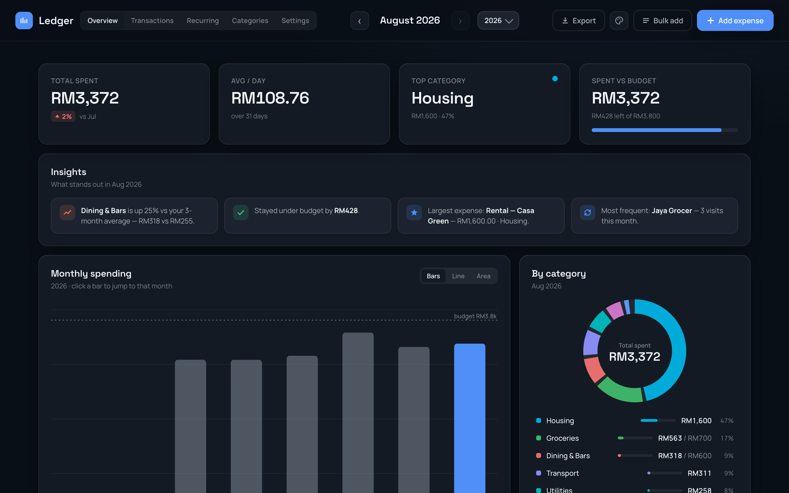
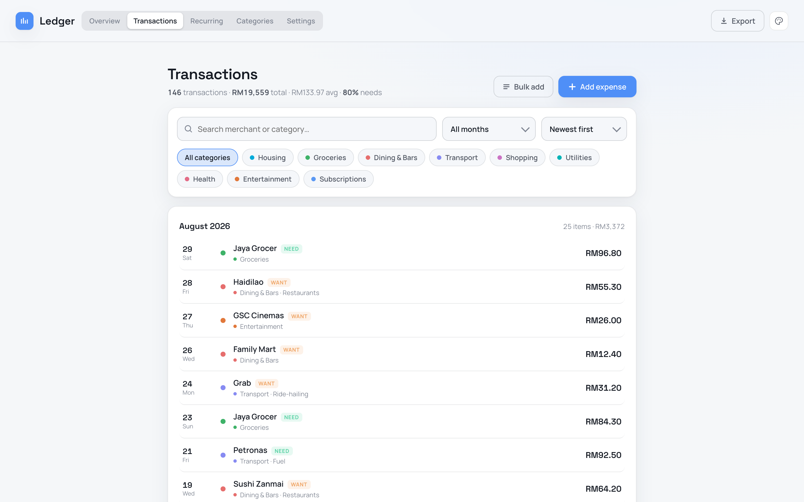
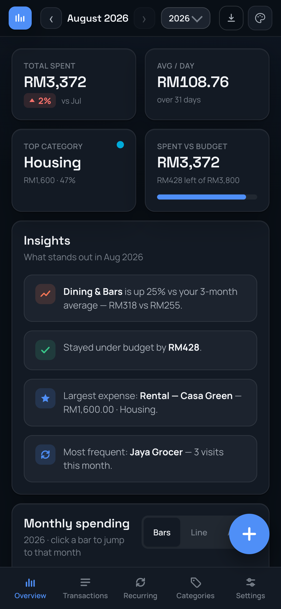
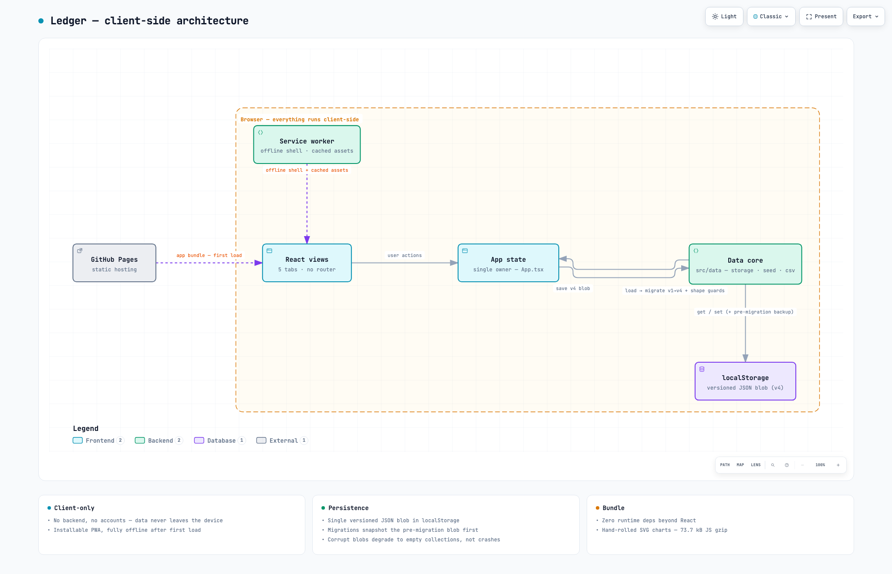

# Ledger — Expense Tracker

A local-first expense tracker PWA. All data lives in your browser — no backend, no account, no tracking. Built with React 18 + TypeScript (strict) and zero runtime dependencies beyond React itself.

**[Live demo →](https://meepinggale.github.io/expense-web/)** · [](https://github.com/MeepingGale/expense-web/actions/workflows/deploy.yml)



I built this to track my own monthly spending and use it daily. Money data is exactly the kind of data that shouldn't sit in someone else's database, so the entire app runs client-side: `localStorage` for state, a service worker for offline, and nothing ever leaves the device.

## Features

**Tracking**
- Add, edit, and delete expenses — with receipt attachments, a 6-second undo window on delete, and a merchant memory that auto-fills category, sub-category, and need/want from past entries
- Bulk add and CSV import for backfilling months at once
- Recurring charges (rent, subscriptions) that auto-post when due, with pause and end dates
- Keyboard-first: `N` opens Add expense, `←`/`→` switch months

**Analysis**
- Monthly overview: spend vs budget, needs vs wants split, auto-generated insights ("Dining is up 25% vs your 3-month average")
- Category donut with per-category budgets and sub-category drill-down
- Monthly trend (bars / line / area), category trends across the year, and a daily-spending calendar

**Data & portability**
- CSV export of all transactions and a printable monthly PDF report
- Versioned storage (v1 → v4 migrations) that snapshots the pre-migration blob before upgrading, so a bad migration or a rollback can't silently destroy data
- Corrupt or hand-edited blobs degrade to empty collections instead of crashing; quota-exceeded writes surface a warning instead of failing silently
- Multi-currency, including MYR

**Experience**
- Installable PWA, fully offline after first load
- Four themes plus OS-follow auto mode, accent colors, compact density — with a pre-paint script so the saved theme applies before React mounts (no flash on reload)

## Screenshots

<table>
  <tr>
    <td valign="top"></td>
    <td valign="top"></td>
  </tr>
</table>

<sub>All screenshots show the bundled demo dataset — not real spending.</sub>

## Architecture

<picture>
  <source media="(prefers-color-scheme: dark)" srcset="docs/screenshots/architecture-dark.png">
  
</picture>

<sub><a href="https://meepinggale.github.io/expense-web/architecture.html">Explore the interactive version →</a> — pan/zoom, search, relationship tracing. Regenerate from <a href="docs/architecture.archify.json">docs/architecture.archify.json</a>.</sub>

- **Vite + React 18 + TypeScript strict.** State lives in `App` and persists as a single versioned JSON blob. No state library, no router — five views and one state owner didn't justify either.
- **`src/data/` is the core:** `storage.ts` (versioned blob, v1→v4 migrations, pre-migration backups, shape guards), `seed.ts` (month scaffold + recurring auto-post), `importCsv.ts`, `format.ts` (currency/formatting), `constants.ts`.
- **Service worker:** navigations go network-first (deploys show up immediately) with the cached shell as offline fallback; hashed assets are cache-first.
- **Charts are hand-rolled SVG** — no chart library, which is most of why the whole app ships in one small bundle.

The project started life as a single-file prototype (HTML + in-browser-Babel JSX, preserved at commit `d45a9f1`) and was rebuilt into strict TypeScript with tests — the diff between the two is a decent tour of what "productionizing a prototype" means.

## Performance & quality — measured, not vibes

Production build, Lighthouse 12 (desktop):

| Metric | Value |
| --- | --- |
| JS bundle (gzip) | **73.7 kB** |
| CSS (gzip) | 9.8 kB |
| Lighthouse Best Practices | **100** |
| Lighthouse Accessibility | 96 |
| Tests | **47 passing** across 7 files (~1.4 s) |

Zero runtime dependencies beyond `react` + `react-dom` — no chart lib, no date lib, no CSS framework — so the bundle stays small and the supply-chain surface stays near zero.

## Security

For a client-only app, most of the work is protecting the user's own data:

- **Content-Security-Policy** as defense-in-depth: no remote script origins can load even if markup is injected; attachments render only from `data:`/`blob:`
- **CSV-injection escaping (CWE-1236)** on export — cells a spreadsheet would evaluate as formulas are neutralized
- **Data-loss guards**: pre-migration backups, corrupt-blob degradation, and `save()` reporting quota failures so the UI can warn instead of dropping writes
- Receipt attachments are stored as data URLs inside the blob — they never touch a server

## Tradeoffs

Choices I'd defend, and where their ceilings are:

- **No backend.** Privacy, zero ops, instant loads. The ceiling is multi-device sync — the plan for that is a small end-to-end-encrypted sync service, not a rewrite.
- **`localStorage` over IndexedDB.** One JSON blob makes versioned migrations trivial, and years of transactions fit comfortably. Receipt attachments are the pressure point; IndexedDB is the upgrade path if they grow.
- **No router.** Five tabs, one state owner. URLs nobody would bookmark aren't worth a dependency.
- **Hand-rolled SVG charts.** Full control over theming and interactions at a fraction of a chart library's weight.

## Run locally

```bash
yarn               # install
yarn dev           # http://localhost:5173
```

Other commands: `yarn test` (Vitest), `yarn typecheck`, `yarn build`.

## Tests & CI

Vitest + Testing Library. Coverage concentrates where breakage is expensive: storage migrations and guards, CSV build/escaping, CSV import parsing, recurring auto-posting, currency formatting, and an app smoke test.

Every push to `main` runs the same pipeline in GitHub Actions — install, tests, typecheck + build — and deploys the built site to GitHub Pages ([`deploy.yml`](.github/workflows/deploy.yml)).

## Roadmap

- Demo-data toggle for the live demo (it currently starts as an empty ledger)
- Remaining Lighthouse points: one low-contrast element, meta description
- End-to-end-encrypted sync for multi-device use

## License

**All rights reserved.** The source is public to read, not to use — no permission is granted to copy, modify, or redistribute it in any form. See [LICENSE](LICENSE).
